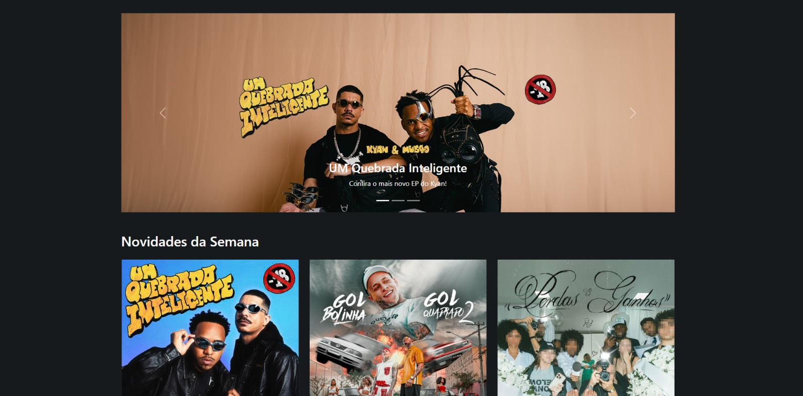

<h1 align="center">
  MusicFy 
</h1>

## 📷 Deploy

<h3>LINK: https://musicfy-bs.vercel.app</h3>

## 💻 Projeto
Projeto próprio, onde consegui aplicar os conceitos de Bootstrap para a criação de uma page sobre novidades de músicas da semana, utilizado como projeto de conclusão de módulo na EBAC - Escola Britânica de Artes Criativas e Tecnologia.

## 🚀 Tecnologias
- Bootstrap
- HTML
- CSS

## 📔 Conhecimentos utilizados
- [x] Responsividade Bootstrap
